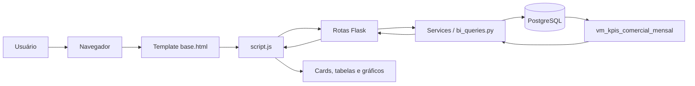

# Rede Comercial Aurora BI

Aplicação web em Flask para análise comercial, consulta de indicadores e simulação operacional de uma rede de vendas. O sistema integra uma interface administrativa com filtros, dashboards, cadastro de vendas, controle visual de permissões e leitura de dados em PostgreSQL.

## Objetivo

O projeto tem como objetivo consolidar dados comerciais em uma experiência simples de Business Intelligence. Ele permite acompanhar receita, margem, volume de vendas, produtos, filiais, clientes e usuários por meio de dashboards interativos conectados ao banco de dados.

## Telas Principais

| Tela | Descrição |
|---|---|
| Dashboard geral | Visão consolidada com KPIs, evolução da receita, ranking por filial, categorias e produtos. |
| Dashboard de vendas | Análise mensal de vendas, receita bruta, descontos, receita líquida e quantidade de pedidos. |
| Dashboard por filial | Ranking e comparação de receita líquida e margem média por filial. |
| Dashboard por categoria | Participação e desempenho comercial por categoria de produto. |
| Nova venda | Formulário para registrar venda no banco e atualizar a materialized view de KPIs. |
| Produtos | Catálogo de produtos com categoria, marca, preço, status e receita. |
| Clientes | Lista de clientes cadastrados no banco. |
| Gerenciar usuários | Cadastro, alteração de status e remoção de usuários da aplicação. |
| Permissões | Matriz visual das permissões por perfil. |
| Relatórios | Visualização resumida de indicadores por filial e categoria. |

## Tecnologias Utilizadas

| Camada | Tecnologia |
|---|---|
| Backend | Python, Flask |
| Banco de dados | PostgreSQL |
| Acesso a dados | SQLAlchemy Core com SQL textual parametrizado |
| Driver PostgreSQL | psycopg 3 |
| Frontend | HTML, CSS, JavaScript |
| Gráficos | Chart.js |
| Variáveis de ambiente | python-dotenv |
| Infraestrutura local | Docker Compose |
| Produção sugerida | Gunicorn + Nginx |

## Arquitetura

O projeto segue uma arquitetura web em camadas:



Documentação detalhada:

- [Arquitetura](docs/arquitetura.md)
- [Backend](docs/backend.md)
- [Frontend](docs/frontend.md)
- [Banco de dados](docs/database.md)
- [Modelo do banco](docs/modelo_banco.md)
- [Triggers e procedures](docs/triggers_procedures.md)
- [Consultas com subqueries](docs/consultas_subqueries.md)
- [Endpoints REST](docs/endpoints_api.md)
- [Guia de execucao](docs/guia_execucao.md)
- [API](docs/api.md)
- [Permissões](docs/permissoes.md)
- [Dashboards](docs/dashboard.md)
- [Instalação](docs/instalacao.md)
- [Deploy](docs/deploy.md)
- [Manutenção](docs/manutencao.md)

## Estrutura de Pastas

```text
projeto-comercial-DB/
├── app/
│   ├── __init__.py
│   ├── config.py
│   ├── db.py
│   ├── routes.py
│   ├── services/
│   │   └── bi_queries.py
│   ├── static/
│   │   ├── css/style.css
│   │   └── js/script.js
│   └── templates/
│       ├── base.html
│       └── login.html
├── db/
│   ├── init/cria_banco.sql
│   └── docs/modelo_banco.md
├── docs/
├── infra/docker/docker-compose.yml
├── requirements.txt
├── run.py
└── .env
```

Veja detalhes em [estrutura_pastas.md](docs/estrutura_pastas.md).

## Instalação Rápida

1. Crie e ative o ambiente virtual:

```powershell
python -m venv venv
venv\Scripts\activate
```

2. Instale dependências:

```powershell
pip install -r requirements.txt
```

3. Suba o PostgreSQL com Docker:

```powershell
docker compose -f infra/docker/docker-compose.yml up -d
```

4. Configure o arquivo `.env`:

```env
DB_HOST=localhost
DB_PORT=5782
DB_NAME=bi_comercial_db
DB_USER=bi_user
DB_PASSWORD=bi_pass
```

5. Execute o script SQL no banco `bi_comercial_db` se o volume do Docker já existia antes desta versão. Em ambientes novos, o Docker Compose monta `db/init/cria_banco.sql` em `/docker-entrypoint-initdb.d/` e inicializa o banco automaticamente na primeira subida:

```text
db/init/cria_banco.sql
db/banco_completo.sql
```

Use `db/banco_completo.sql` quando quiser um unico arquivo contendo criacao do banco, triggers, procedures/functions, fix de schema e consultas com subqueries.

6. Rode o Flask:

```powershell
python run.py
```

7. Acesse:

```text
http://127.0.0.1:5000/
```

Guia completo em [instalacao.md](docs/instalacao.md).

## Usuários de Teste

| Perfil | Email | Senha | Acesso |
|---|---|---|---|
| Admin Comercial | admin@aurora.local | admin123 | Acesso completo, usuários, dashboards, vendas e permissões. |
| Gerente Comercial | gerente@aurora.local | gerente123 | Dashboards, consultas e relatórios. |
| Operador Comercial | operador@aurora.local | operador123 | Cadastro de venda, produtos, clientes e dashboard de vendas. |
| Leitura Comercial | leitura@aurora.local | leitura123 | Leitura de dashboards e relatórios. |

## Permissões

O controle de permissões é aplicado no frontend por perfil e também nas rotas sensíveis do backend. A autenticação usa a rota `/auth/login`, cria sessão Flask e mantém os usuários na tabela `comercial.app_usuario`.

Resumo:

| Perfil | Permissões principais |
|---|---|
| Admin Comercial | Acesso total. |
| Gerente Comercial | Visualização de dashboards, consultas e relatórios. |
| Operador Comercial | Cadastro de vendas e visualização operacional. |
| Leitura Comercial | Apenas leitura de dashboards e relatórios. |

Detalhes em [permissoes.md](docs/permissoes.md).

## Funcionalidades Principais

- KPIs comerciais por período, filial, categoria e produto.
- Filtros globais por data, filial, categoria e produto.
- Dashboards com Chart.js.
- Consulta de produtos e clientes diretamente no PostgreSQL.
- Cadastro de clientes e produtos comerciais pela interface, com mensagens de sucesso/erro e recarga automatica dos dados.
- Registro de nova venda com persistência em tabelas fato.
- Atualização da materialized view após cadastro de venda.
- Gerenciamento de usuários da aplicação.
- Aviso visual quando o banco está indisponível, sem usar dados locais como fallback.

Tambem ha uma tela Rotinas SQL para listar triggers, procedures/functions e executar uma demo real das rotinas no PostgreSQL.

## Banco de Dados Atualizado

O schema `comercial` possui pelo menos 10 tabelas base: `dim_calendario`, `dim_filial`, `dim_categoria`, `dim_produto`, `dim_cliente`, `dim_canal_venda`, `app_usuario`, `usuarios`, `log_operacao`, `fato_vendas`, `fato_itens_venda`, `dim_fornecedor` e `movimentacao_estoque`.

As triggers versionadas incluem `trg_calcular_totais_item`, `trg_validar_venda`, `trg_auditar_usuario`, `trg_auditar_venda`, `trg_usuarios_updated_at` e `trg_movimentar_estoque_venda`. Elas calculam totais de item, validam receita liquida, gravam auditoria em `log_operacao`, atualizam timestamps e registram movimentacao de estoque.

As rotinas principais incluem `fn_calcular_receita_liquida`, `fn_obter_ou_criar_data`, `fn_resumo_comercial_subqueries`, `fn_faturamento_periodo`, `fn_ranking_produtos`, `pr_refresh_kpis`, `pr_cadastrar_usuario` e `pr_cadastrar_produto`. A funcao `fn_resumo_comercial_subqueries` usa subqueries para contar clientes, produtos acima do preco medio, vendas acima do ticket medio e a data da ultima venda.

Cadastros operacionais:

| Tela | Acao | Endpoint |
|---|---|---|
| Gerenciar usuarios | Criar, alterar status e remover usuario | `/usuarios` |
| Produtos | Criar produto comercial | `POST /produtos` |
| Clientes | Criar cliente comercial | `POST /clientes` |
| Nova venda | Inserir venda e item de venda | `POST /vendas` |

Apos cada cadastro, o frontend recarrega automaticamente listas, tabelas, KPIs e graficos afetados.

## API REST Padronizada

Endpoints principais:

- `GET/POST /api/usuarios`
- `GET/PUT/DELETE /api/usuarios/<id>`
- `GET/POST /api/produtos`
- `PUT/DELETE /api/produtos/<id>`
- `GET/POST /api/filiais`
- `GET/POST /api/categorias`
- `GET/POST /api/vendas`
- `GET /api/dashboard/resumo`
- `GET /api/dashboard/vendas-mes`
- `GET /api/dashboard/produtos-ranking`
- `GET /api/dashboard/filiais`
- `GET /api/banco/rotinas`
- `POST /api/banco/rotinas/executar-demo`

Formato de sucesso:

```json
{
  "success": true,
  "message": "Operacao realizada com sucesso.",
  "data": {}
}
```

Formato de erro:

```json
{
  "success": false,
  "message": "Erro ao realizar operacao.",
  "error": "Detalhe tecnico do erro."
}
```

## Prints

Espaco reservado para prints da tela de dashboard, usuarios, produtos, vendas, filiais e categorias.

## Dashboards Existentes

- Dashboard geral
- Dashboard de vendas
- Dashboard por filial
- Dashboard por categoria
- Relatórios executivos

Métricas principais:

- Faturamento bruto
- Receita líquida
- Custo total
- Margem bruta
- Margem bruta percentual
- Quantidade vendida
- Quantidade de vendas
- Ticket médio

## Fluxo do Sistema

1. Usuário acessa a aplicação e, se não houver sessão, é redirecionado para `/login`.
2. O usuário autentica por e-mail e senha em `/auth/login`.
3. O backend grava os dados do usuário na sessão Flask.
4. A interface principal carrega `/auth/me`, filtros, clientes e produtos.
5. O frontend habilita telas conforme permissões do perfil.
6. Os dashboards consultam endpoints Flask protegidos por sessão.
7. Os endpoints executam queries SQL em `bi_queries.py`.
8. O PostgreSQL retorna dados agregados da view `vm_kpis_comercial_mensal`.
9. O frontend renderiza cards, tabelas e gráficos.

## Melhorias Futuras

- Evoluir sessão com Flask-Login ou armazenamento server-side.
- Armazenar senha com hash seguro.
- Adicionar testes automatizados de API e UI.
- Criar migrations com Alembic.
- Ampliar a matriz de permissões backend para todas as telas analíticas.
- Adicionar logs estruturados.
- Incluir screenshots reais da interface na documentação.
- Criar pipeline CI/CD.
- Implementar refresh concorrente da materialized view.

## Créditos

Projeto acadêmico/profissional de portfólio para análise comercial e modelagem de banco de dados.

Consulte [docs/Integrantes.md](docs/Integrantes.md) para os integrantes registrados no repositório.
