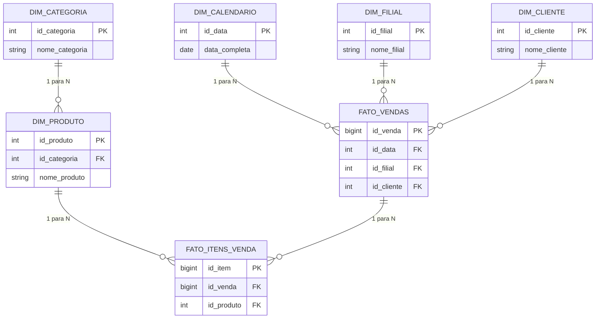
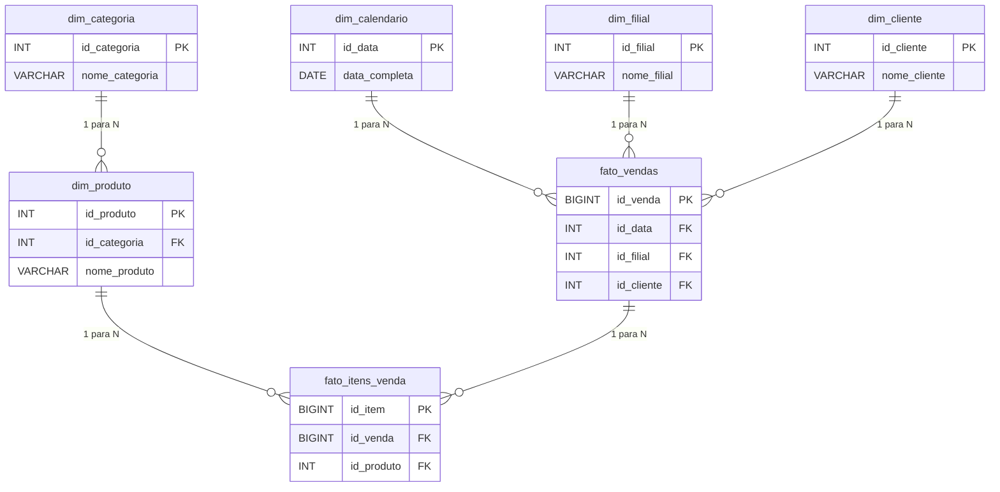

# Modelo do Banco de Dados

## 1. Introdução

Este documento descreve o modelo de dados do schema `comercial`, definido no script `db/init/cria_banco.sql`. O banco de dados foi concebido para suportar um ambiente de análise comercial, com foco em vendas, produtos, filiais, clientes e indicadores de desempenho. A estrutura segue um padrão dimensional típico de Business Intelligence, em que tabelas de dimensão alimentam fatos de vendas e itens de venda.

O objetivo principal do banco é registrar transações comerciais e disponibilizar uma base analítica para geração de KPIs mensais, trazendo suporte ao acompanhamento de faturamento, margem, ticket médio e volume de vendas por filial, categoria e produto.

## 2. Levantamento do Script

O script `cria_banco.sql` executa as seguintes ações principais:

- Remove o schema `comercial` caso exista, utilizando `DROP SCHEMA IF EXISTS comercial CASCADE`.
- Cria o schema `comercial` com autorização para o usuário `bi_user`.
- Cria as tabelas de dimensão e fato necessárias para o modelo analítico.
- Insere dados de exemplo nas dimensões e na tabela de fatos.
- Cria índices para otimizar consultas sobre fatos e dimensões.
- Cria uma `MATERIALIZED VIEW` destinada a KPIs comerciais mensais.

### Tabelas Criadas

- `comercial.dim_calendario`
- `comercial.dim_filial`
- `comercial.dim_categoria`
- `comercial.dim_produto`
- `comercial.dim_cliente`
- `comercial.fato_vendas`
- `comercial.fato_itens_venda`

Além das tabelas, o script cria a materialized view:

- `comercial.vm_kpis_comercial_mensal`

### Campos Principais e Tipos de Dados

- Chaves primárias automáticas: `SERIAL` e `BIGSERIAL` em dimensões e fatos.
- Datas: `DATE` para data de cadastro e data completa.
- Valores monetários: `NUMERIC(10,2)` e `NUMERIC(14,2)` para preços, custos, valores e descontos.
- Textos: `VARCHAR` com tamanhos adequados para nomes, descrições e status.
- Identificadores únicos: `UNIQUE` em campos como `data_completa`, `nome_filial`, `nome_categoria`, `nome_produto` e `numero_pedido`.

### Chaves Primárias

- `dim_calendario.id_data`
- `dim_filial.id_filial`
- `dim_categoria.id_categoria`
- `dim_produto.id_produto`
- `dim_cliente.id_cliente`
- `fato_vendas.id_venda`
- `fato_itens_venda.id_item`

### Chaves Estrangeiras

- `dim_produto.id_categoria` → `dim_categoria(id_categoria)`
- `fato_vendas.id_data` → `dim_calendario(id_data)`
- `fato_vendas.id_filial` → `dim_filial(id_filial)`
- `fato_vendas.id_cliente` → `dim_cliente(id_cliente)`
- `fato_itens_venda.id_venda` → `fato_vendas(id_venda)`
- `fato_itens_venda.id_produto` → `dim_produto(id_produto)`

### Relacionamentos

O modelo apresenta:

- Uma tabela de fatos de vendas (`fato_vendas`) relacionada a três dimensões: calendário, filial e cliente.
- Uma tabela de itens de venda (`fato_itens_venda`) detalhando cada produto vendido em uma venda.
- Uma relação entre produto e categoria na dimensão de produto.
- A materialized view agrega dados de fatos e dimensões para cálculo de KPIs.

### Constraints Importantes

- `NOT NULL` em colunas essenciais para garantir integridade, como datas, chaves estrangeiras, quantidades e valores.
- `UNIQUE` em campos de identificação e nomes, garantindo unicidade de pedidos, filiais, categorias e produtos.
- `DEFAULT` para `status` em `dim_produto` e `status_venda` em `fato_vendas`.
- Índices de base para otimizar pesquisa por data, filial, cliente, produto e categoria.

### Comandos Importantes

- `CREATE SCHEMA`, `CREATE TABLE`, `INSERT INTO`, `UPDATE`, `CREATE INDEX`, `CREATE MATERIALIZED VIEW`.
- Uso de `generate_series` para popular calorosamente dimensões e fatos com dados de exemplo.
- Criação e atualização de valores calculados em `fato_itens_venda` e `fato_vendas` após a carga inicial.

## 3. Requisitos Funcionais

- RF01 — O sistema deve armazenar um calendário analítico com ano, mês, trimestre e semestre.
- RF02 — O sistema deve registrar filiais com nome, cidade, estado, região e porte.
- RF03 — O sistema deve categorizar produtos e armazenar informações de preço e custo.
- RF04 — O sistema deve manter cadastro de clientes com tipo e data de cadastro.
- RF05 — O sistema deve registrar vendas com identificação, forma de pagamento, status e valores financeiros.
- RF06 — O sistema deve detalhar os itens de cada venda com produto, quantidade, preço e custo.
- RF07 — O sistema deve gerar uma visão consolidada de KPIs mensais a partir das vendas concluídas.

## 4. Requisitos Não Funcionais

- RNF01 — O banco deve garantir integridade referencial entre fatos e dimensões.
- RNF02 — O banco deve usar tipos de dados adequados para valores monetários e datas.
- RNF03 — O banco deve preservar unicidade em campos de identificação importantes.
- RNF04 — O banco deve suportar consultas de desempenho com índices nas colunas de filtro críticas.
- RNF05 — O banco deve isolar o modelo analítico em um schema dedicado (`comercial`).

## 5. Modelo Conceitual

O modelo conceitual apresenta as entidades principais do contexto comercial: dimensões para data, filial, categoria, produto e cliente; e fatos para vendas e itens de venda. A materialized view é um objeto de consulta analítica construído a partir desses elementos.

## 6. Modelo Lógico

### Tabelas e Atributos

- `comercial.dim_calendario`
  - `id_data` — `SERIAL`, PK
  - `data_completa` — `DATE`, NOT NULL, UNIQUE
  - `ano` — `INT`, NOT NULL
  - `mes` — `INT`, NOT NULL
  - `nome_mes` — `VARCHAR(20)`, NOT NULL
  - `trimestre` — `INT`, NOT NULL
  - `semestre` — `INT`, NOT NULL

- `comercial.dim_filial`
  - `id_filial` — `SERIAL`, PK
  - `nome_filial` — `VARCHAR(100)`, NOT NULL, UNIQUE
  - `cidade` — `VARCHAR(80)`, NOT NULL
  - `uf` — `CHAR(2)`, NOT NULL
  - `regiao` — `VARCHAR(30)`, NOT NULL
  - `porte` — `VARCHAR(30)`, NOT NULL

- `comercial.dim_categoria`
  - `id_categoria` — `SERIAL`, PK
  - `nome_categoria` — `VARCHAR(100)`, NOT NULL, UNIQUE
  - `descricao` — `VARCHAR(255)`

- `comercial.dim_produto`
  - `id_produto` — `SERIAL`, PK
  - `id_categoria` — `INT`, NOT NULL, FK → `dim_categoria(id_categoria)`
  - `nome_produto` — `VARCHAR(120)`, NOT NULL, UNIQUE
  - `marca` — `VARCHAR(80)`
  - `preco_venda` — `NUMERIC(10,2)`, NOT NULL
  - `custo_produto` — `NUMERIC(10,2)`, NOT NULL
  - `status` — `VARCHAR(20)`, NOT NULL, DEFAULT `'ATIVO'`

- `comercial.dim_cliente`
  - `id_cliente` — `SERIAL`, PK
  - `nome_cliente` — `VARCHAR(120)`, NOT NULL
  - `tipo_cliente` — `VARCHAR(30)`, NOT NULL
  - `cidade` — `VARCHAR(80)`
  - `uf` — `CHAR(2)`
  - `data_cadastro` — `DATE`, NOT NULL

- `comercial.fato_vendas`
  - `id_venda` — `BIGSERIAL`, PK
  - `id_data` — `INT`, NOT NULL, FK → `dim_calendario(id_data)`
  - `id_filial` — `INT`, NOT NULL, FK → `dim_filial(id_filial)`
  - `id_cliente` — `INT`, FK → `dim_cliente(id_cliente)`
  - `numero_pedido` — `VARCHAR(30)`, NOT NULL, UNIQUE
  - `forma_pagamento` — `VARCHAR(40)`, NOT NULL
  - `status_venda` — `VARCHAR(30)`, NOT NULL, DEFAULT `'CONCLUIDA'`
  - `valor_bruto` — `NUMERIC(14,2)`, NOT NULL
  - `desconto` — `NUMERIC(14,2)`, NOT NULL
  - `valor_liquido` — `NUMERIC(14,2)`, NOT NULL

- `comercial.fato_itens_venda`
  - `id_item` — `BIGSERIAL`, PK
  - `id_venda` — `BIGINT`, NOT NULL, FK → `fato_vendas(id_venda)`
  - `id_produto` — `INT`, NOT NULL, FK → `dim_produto(id_produto)`
  - `quantidade` — `INT`, NOT NULL
  - `valor_unitario` — `NUMERIC(10,2)`, NOT NULL
  - `custo_unitario` — `NUMERIC(10,2)`, NOT NULL
  - `valor_total` — `NUMERIC(14,2)`, NOT NULL
  - `custo_total` — `NUMERIC(14,2)`, NOT NULL

### Cardinalidades

- `dim_calendario` 1 — N `fato_vendas`
- `dim_filial` 1 — N `fato_vendas`
- `dim_cliente` 1 — N `fato_vendas`
- `dim_categoria` 1 — N `dim_produto`
- `dim_produto` 1 — N `fato_itens_venda`
- `fato_vendas` 1 — N `fato_itens_venda`

### Diagrama Lógico

## 7. Dicionário de Dados

### `dim_calendario`

| Campo | Tipo | Chave | Obrigatório | Descrição |
|---|---|---|---|---|
| id_data | SERIAL | PK | Sim | Identificador sequencial da data. |
| data_completa | DATE | - | Sim | Data calendarizada, única para cada registro. |
| ano | INT | - | Sim | Ano correspondente à data. |
| mes | INT | - | Sim | Mês correspondente à data. |
| nome_mes | VARCHAR(20) | - | Sim | Nome do mês em formato textual. |
| trimestre | INT | - | Sim | Trimestre do ano. |
| semestre | INT | - | Sim | Semestre do ano. |

### `dim_filial`

| Campo | Tipo | Chave | Obrigatório | Descrição |
|---|---|---|---|---|
| id_filial | SERIAL | PK | Sim | Identificador da filial. |
| nome_filial | VARCHAR(100) | - | Sim | Nome único da filial. |
| cidade | VARCHAR(80) | - | Sim | Cidade onde a filial está localizada. |
| uf | CHAR(2) | - | Sim | Unidade federativa da filial. |
| regiao | VARCHAR(30) | - | Sim | Região geográfica da filial. |
| porte | VARCHAR(30) | - | Sim | Porte da filial. |

### `dim_categoria`

| Campo | Tipo | Chave | Obrigatório | Descrição |
|---|---|---|---|---|
| id_categoria | SERIAL | PK | Sim | Identificador da categoria. |
| nome_categoria | VARCHAR(100) | - | Sim | Nome único da categoria de produtos. |
| descricao | VARCHAR(255) | - | Não | Descrição da categoria. |

### `dim_produto`

| Campo | Tipo | Chave | Obrigatório | Descrição |
|---|---|---|---|---|
| id_produto | SERIAL | PK | Sim | Identificador do produto. |
| id_categoria | INT | FK | Sim | Categoria associada ao produto. |
| nome_produto | VARCHAR(120) | - | Sim | Nome único do produto. |
| marca | VARCHAR(80) | - | Não | Marca do produto. |
| preco_venda | NUMERIC(10,2) | - | Sim | Preço de venda do produto. |
| custo_produto | NUMERIC(10,2) | - | Sim | Custo do produto. |
| status | VARCHAR(20) | - | Sim | Status do produto, padrão `ATIVO`. |

### `dim_cliente`

| Campo | Tipo | Chave | Obrigatório | Descrição |
|---|---|---|---|---|
| id_cliente | SERIAL | PK | Sim | Identificador do cliente. |
| nome_cliente | VARCHAR(120) | - | Sim | Nome do cliente. |
| tipo_cliente | VARCHAR(30) | - | Sim | Tipo do cliente (`B2B` ou `B2C` no dataset). |
| cidade | VARCHAR(80) | - | Não | Cidade do cliente. |
| uf | CHAR(2) | - | Não | Estado do cliente. |
| data_cadastro | DATE | - | Sim | Data de cadastro do cliente. |

### `fato_vendas`

| Campo | Tipo | Chave | Obrigatório | Descrição |
|---|---|---|---|---|
| id_venda | BIGSERIAL | PK | Sim | Identificador da venda. |
| id_data | INT | FK | Sim | Data da venda associada à dimensão de calendário. |
| id_filial | INT | FK | Sim | Filial onde a venda foi realizada. |
| id_cliente | INT | FK | Não | Cliente associado à venda. |
| numero_pedido | VARCHAR(30) | - | Sim | Número único do pedido. |
| forma_pagamento | VARCHAR(40) | - | Sim | Forma de pagamento utilizada. |
| status_venda | VARCHAR(30) | - | Sim | Status da venda, padrão `CONCLUIDA`. |
| valor_bruto | NUMERIC(14,2) | - | Sim | Valor bruto da venda. |
| desconto | NUMERIC(14,2) | - | Sim | Desconto aplicado na venda. |
| valor_liquido | NUMERIC(14,2) | - | Sim | Valor líquido após desconto. |

### `fato_itens_venda`

| Campo | Tipo | Chave | Obrigatório | Descrição |
|---|---|---|---|---|
| id_item | BIGSERIAL | PK | Sim | Identificador do item de venda. |
| id_venda | BIGINT | FK | Sim | Venda pai associada ao item. |
| id_produto | INT | FK | Sim | Produto vendido. |
| quantidade | INT | - | Sim | Quantidade vendida do produto. |
| valor_unitario | NUMERIC(10,2) | - | Sim | Preço unitário de venda. |
| custo_unitario | NUMERIC(10,2) | - | Sim | Custo unitário do produto. |
| valor_total | NUMERIC(14,2) | - | Sim | Valor total calculado para o item. |
| custo_total | NUMERIC(14,2) | - | Sim | Custo total calculado para o item. |

## 8. Relacionamentos

- `dim_calendario` → `fato_vendas`: uma data no calendário pode estar presente em muitas vendas.
- `dim_filial` → `fato_vendas`: uma filial pode registrar várias vendas.
- `dim_cliente` → `fato_vendas`: um cliente pode aparecer em várias vendas.
- `dim_categoria` → `dim_produto`: uma categoria agrupa vários produtos.
- `dim_produto` → `fato_itens_venda`: um produto pode ser vendido em muitos itens.
- `fato_vendas` → `fato_itens_venda`: cada venda pode conter vários itens de venda.

A função desses relacionamentos é manter a consistência entre os dados analíticos e permitir consultas multidimensionais, como análise de vendas por período, filial, categoria e produto.

## 9. Conclusão

A modelagem descrita no script SQL é adequada para um projeto de análise comercial. Ela separa claramente dimensões e fatos, garante integridade referencial, e usa tipos de dados apropriados para valores financeiros e datas.

Essa estrutura é importante porque oferece base confiável para relatórios e KPIs, permitindo ao sistema apresentar análises de faturamento e margem com clareza, além de apoiar a manutenção e evolução do projeto de forma organizada.
