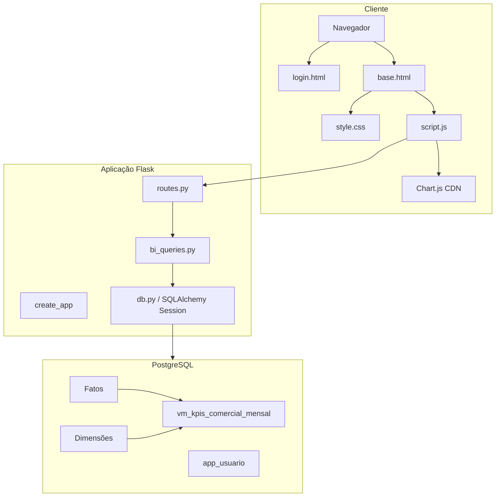
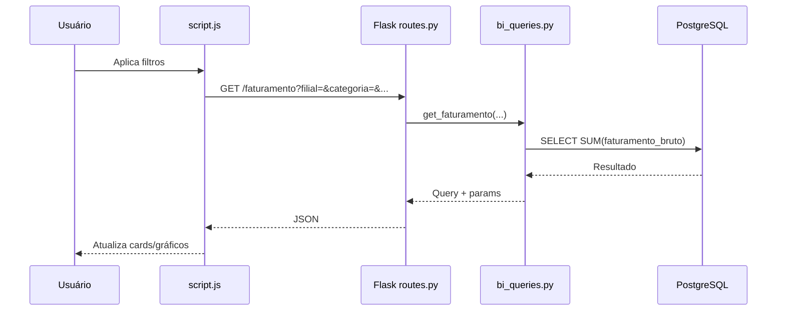
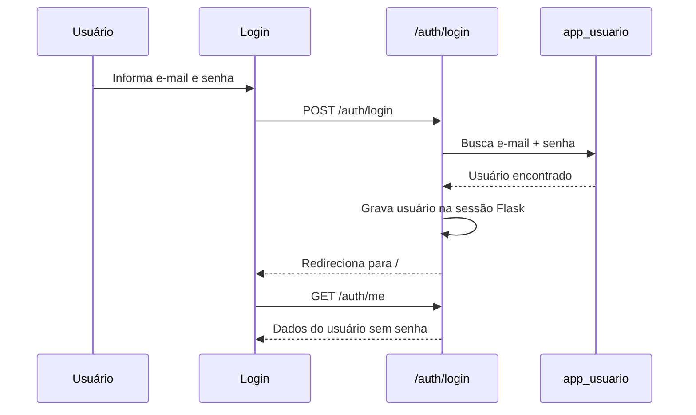
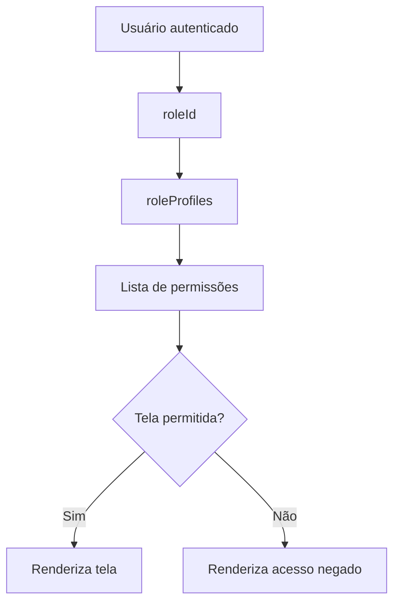

# Arquitetura do Sistema

## Visão Geral

O Rede Comercial Aurora BI é uma aplicação web monolítica em Flask, com frontend renderizado por template HTML e comportamento dinâmico em JavaScript. O backend expõe endpoints JSON que consultam e gravam dados em PostgreSQL. A camada de serviços centraliza as queries SQL em `app/services/bi_queries.py`.

## Componentes

| Componente | Arquivo/Pasta | Responsabilidade |
|---|---|---|
| Entrada Flask | `run.py` | Inicializa a aplicação criada por `create_app()`. |
| Factory Flask | `app/__init__.py` | Cria a aplicação, registra rotas e handler global de erro de banco. |
| Configuração | `app/config.py` | Carrega variáveis do `.env`. |
| Banco | `app/db.py` | Cria engine SQLAlchemy e sessões. |
| Rotas | `app/routes.py` | Controllers HTTP e serialização JSON. |
| Services | `app/services/bi_queries.py` | Queries SQL, regras de validação e operações de escrita. |
| Templates | `app/templates/base.html`, `app/templates/login.html` | Interface principal e tela de autenticação. |
| Frontend | `app/static/js/script.js` | Estado da interface, chamadas API, permissões e gráficos. |
| Estilos | `app/static/css/style.css` | Layout, componentes, responsividade e aparência visual. |
| Banco SQL | `db/init/cria_banco.sql` | DDL, DML, índices, views e usuários iniciais. |
| Infra | `infra/docker/docker-compose.yml` | PostgreSQL local em container. |

## Diagrama de Componentes



## Padrão Arquitetural

O projeto se aproxima de MVC com services:

| Papel | Implementação |
|---|---|
| Model | Tabelas e views PostgreSQL, acessadas por SQL textual. |
| View | `base.html`, CSS e renderizações dinâmicas em JavaScript. |
| Controller | Rotas Flask em `routes.py`. |
| Service | `bi_queries.py`, contendo SQL, validações e regras de persistência. |

Não há ORM declarativo com classes de modelo. O SQLAlchemy é usado para engine, pool, sessões e execução de SQL parametrizado.

## Comunicação Frontend/Backend

O frontend usa `fetch()` para consultar endpoints JSON:



## Comunicação com Banco

A conexão é configurada em `app/db.py`:

```python
engine = create_engine(
    DATABASE_URL,
    pool_pre_ping=True,
    pool_recycle=300,
    connect_args={"connect_timeout": 1}
)
```

Características:

- `pool_pre_ping=True`: detecta conexões mortas.
- `pool_recycle=300`: recicla conexões antigas.
- `connect_timeout=1`: evita travamento prolongado em caso de banco indisponível.
- sessões são abertas por rota e fechadas no `finally`.

## Fluxo de Autenticação



Observação: a autenticação atual usa sessão Flask. O frontend filtra as telas visualmente e o backend valida sessão e permissões nas ações sensíveis.

## Fluxo de Permissões

As permissões são declaradas em `roleProfiles` no `script.js`. Cada tela possui uma permissão exigida no array `screens`.



## Fluxo dos Dashboards

1. `loadDashboardData()` monta query string com filtros globais.
2. A aplicação consulta endpoints de KPIs e tabelas.
3. Dados são normalizados no frontend.
4. Cards são renderizados por `renderKpis()`.
5. Gráficos são renderizados por `renderCharts()` com Chart.js.

## Rotas

As rotas estão em `app/routes.py` e funcionam como controllers:

- recebem parâmetros HTTP;
- abrem sessão no banco;
- chamam funções em `bi_queries.py`;
- serializam resultados em JSON;
- fazem `commit`, `rollback` ou `close`.

## Services

`bi_queries.py` concentra:

- queries de KPIs;
- consultas auxiliares de filtros;
- validações de usuários;
- criação de venda;
- refresh da materialized view;
- criação automática da tabela `app_usuario` quando necessário.

## Templates e Assets

`base.html` define o shell da aplicação:

- alerta de banco indisponível;
- sidebar;
- painel de sessão;
- navegação principal;
- filtros globais;
- área dinâmica `#viewRoot`.

`login.html` define o formulário de entrada por e-mail e senha.

`script.js` injeta os conteúdos de tela em `#viewRoot`.

## Integrações

| Integração | Uso |
|---|---|
| PostgreSQL | Armazenamento transacional e analítico. |
| Chart.js CDN | Renderização de gráficos. |
| Docker Compose | Banco local para desenvolvimento. |
| python-dotenv | Configuração de ambiente. |

## Pontos de Evolução Arquitetural

- Evoluir autenticação para Flask-Login ou sessão server-side.
- Criar camada repository para separar SQL de regras.
- Usar migrations com Alembic.
- Implementar testes automatizados.
- Ampliar permissões backend para todos os endpoints analíticos se necessário.
- Remover dependência de CDN em ambientes restritos.
