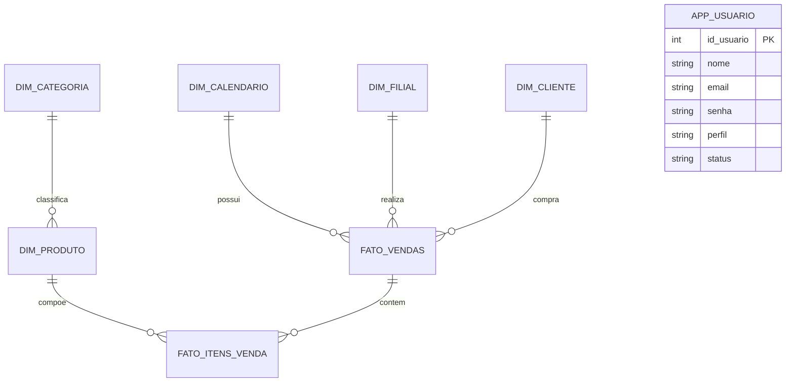
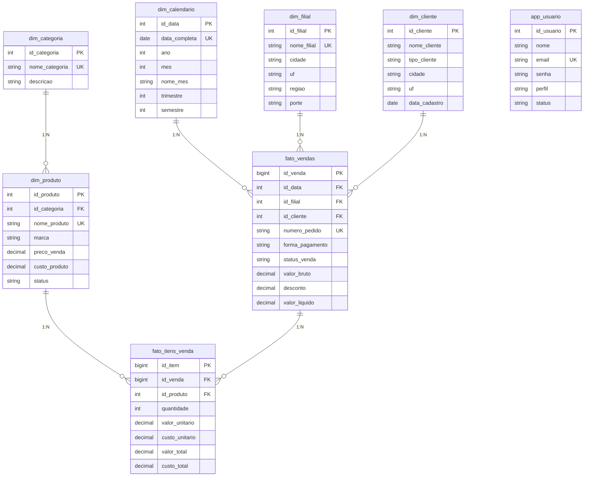

# Banco de Dados

## Visão Geral

O banco PostgreSQL usa o schema `comercial` para armazenar dimensões, fatos, usuários da aplicação, views e materialized views. O desenho principal segue modelagem dimensional para BI.

## Schema

```sql
CREATE SCHEMA comercial;
```

No ambiente Docker, o banco padrão é:

```text
bi_comercial_db
```

## Modelo Conceitual

Entidades principais:

- Calendário
- Filial
- Categoria
- Produto
- Cliente
- Usuário da aplicação
- Venda
- Item de venda
- View analítica mensal



## Modelo Lógico

### `comercial.dim_calendario`

| Coluna | Tipo | Regra |
|---|---|---|
| `id_data` | SERIAL | PK |
| `data_completa` | DATE | NOT NULL, UNIQUE |
| `ano` | INT | NOT NULL |
| `mes` | INT | NOT NULL |
| `nome_mes` | VARCHAR(20) | NOT NULL |
| `trimestre` | INT | NOT NULL |
| `semestre` | INT | NOT NULL |

### `comercial.dim_filial`

| Coluna | Tipo | Regra |
|---|---|---|
| `id_filial` | SERIAL | PK |
| `nome_filial` | VARCHAR(100) | NOT NULL, UNIQUE |
| `cidade` | VARCHAR(80) | NOT NULL |
| `uf` | CHAR(2) | NOT NULL |
| `regiao` | VARCHAR(30) | NOT NULL |
| `porte` | VARCHAR(30) | NOT NULL |

### `comercial.dim_categoria`

| Coluna | Tipo | Regra |
|---|---|---|
| `id_categoria` | SERIAL | PK |
| `nome_categoria` | VARCHAR(100) | NOT NULL, UNIQUE |
| `descricao` | VARCHAR(255) | Opcional |

### `comercial.dim_produto`

| Coluna | Tipo | Regra |
|---|---|---|
| `id_produto` | SERIAL | PK |
| `id_categoria` | INT | FK para `dim_categoria` |
| `nome_produto` | VARCHAR(120) | NOT NULL, UNIQUE |
| `marca` | VARCHAR(80) | Opcional |
| `preco_venda` | NUMERIC(10,2) | NOT NULL |
| `custo_produto` | NUMERIC(10,2) | NOT NULL |
| `status` | VARCHAR(20) | DEFAULT `ATIVO` |

### `comercial.dim_cliente`

| Coluna | Tipo | Regra |
|---|---|---|
| `id_cliente` | SERIAL | PK |
| `nome_cliente` | VARCHAR(120) | NOT NULL |
| `tipo_cliente` | VARCHAR(30) | NOT NULL |
| `cidade` | VARCHAR(80) | Opcional |
| `uf` | CHAR(2) | Opcional |
| `data_cadastro` | DATE | NOT NULL |

### `comercial.app_usuario`

Tabela de usuários da aplicação.

| Coluna | Tipo | Regra |
|---|---|---|
| `id_usuario` | SERIAL | PK |
| `nome` | VARCHAR(120) | NOT NULL, mínimo 3 caracteres |
| `email` | VARCHAR(120) | NOT NULL, UNIQUE |
| `senha` | VARCHAR(120) | NOT NULL, mínimo 6 caracteres |
| `perfil` | VARCHAR(30) | `administrador`, `gerente`, `vendedor`, `analista` |
| `status` | VARCHAR(20) | `Ativo` ou `Inativo` |
| `criado_em` | TIMESTAMP | DEFAULT `CURRENT_TIMESTAMP` |

### `comercial.fato_vendas`

| Coluna | Tipo | Regra |
|---|---|---|
| `id_venda` | BIGSERIAL | PK |
| `id_data` | INT | FK para calendário |
| `id_filial` | INT | FK para filial |
| `id_cliente` | INT | FK para cliente |
| `numero_pedido` | VARCHAR(30) | NOT NULL, UNIQUE |
| `forma_pagamento` | VARCHAR(40) | NOT NULL |
| `status_venda` | VARCHAR(30) | DEFAULT `CONCLUIDA` |
| `valor_bruto` | NUMERIC(14,2) | NOT NULL |
| `desconto` | NUMERIC(14,2) | NOT NULL |
| `valor_liquido` | NUMERIC(14,2) | NOT NULL |

### `comercial.fato_itens_venda`

| Coluna | Tipo | Regra |
|---|---|---|
| `id_item` | BIGSERIAL | PK |
| `id_venda` | BIGINT | FK para venda |
| `id_produto` | INT | FK para produto |
| `quantidade` | INT | NOT NULL |
| `valor_unitario` | NUMERIC(10,2) | NOT NULL |
| `custo_unitario` | NUMERIC(10,2) | NOT NULL |
| `valor_total` | NUMERIC(14,2) | NOT NULL |
| `custo_total` | NUMERIC(14,2) | NOT NULL |

## Materialized View

### `comercial.vm_kpis_comercial_mensal`

Consolida dados mensais para dashboards.

Métricas:

| Métrica | Cálculo |
|---|---|
| `quantidade_de_vendas` | `COUNT(DISTINCT v.id_venda)` |
| `quantidade_vendida` | `SUM(i.quantidade)` |
| `faturamento_bruto` | `SUM(i.valor_total)` |
| `desconto_total` | `SUM(v.desconto)` |
| `receita_liquida` | `SUM(i.valor_total) - SUM(v.desconto)` |
| `custo_total` | `SUM(i.custo_total)` |
| `margem_bruta` | Receita líquida menos custo total |
| `margem_bruta_percentual` | Margem bruta / receita líquida |
| `ticket_medio` | Receita líquida / número de vendas |

## Índices

| Índice | Tabela | Objetivo |
|---|---|---|
| `idx_vendas_data` | `fato_vendas` | Filtro por data. |
| `idx_vendas_filial` | `fato_vendas` | Filtro por filial. |
| `idx_vendas_cliente` | `fato_vendas` | Relacionamento com cliente. |
| `idx_itens_venda` | `fato_itens_venda` | Join com venda. |
| `idx_itens_produto` | `fato_itens_venda` | Join com produto. |
| `idx_produto_categoria` | `dim_produto` | Filtro por categoria. |
| `idx_calendario_data` | `dim_calendario` | Busca por data. |
| `idx_vm_comercial_periodo` | `vm_kpis_comercial_mensal` | Dashboard temporal. |
| `idx_vm_comercial_filial` | `vm_kpis_comercial_mensal` | Filtro por filial. |
| `idx_vm_comercial_produto` | `vm_kpis_comercial_mensal` | Filtro por produto. |
| `idx_vm_comercial_categoria` | `vm_kpis_comercial_mensal` | Filtro por categoria. |

## Diagrama DER



## Regras de Negócio no Banco

- Produto pertence a uma categoria.
- Venda pertence a uma data, filial e opcionalmente cliente.
- Item de venda pertence a uma venda e a um produto.
- Pedidos possuem número único.
- Usuário possui email único.
- Dashboards consideram vendas concluídas.

## Procedures

O projeto não possui stored procedures versionadas. A manutenção de agregados é feita por:

```sql
REFRESH MATERIALIZED VIEW comercial.vm_kpis_comercial_mensal;
```

## Dashboards Derivados

| Dashboard | Origem |
|---|---|
| Geral | `vm_kpis_comercial_mensal` |
| Vendas | `vm_kpis_comercial_mensal` |
| Filial | `vm_kpis_comercial_mensal` agrupada por filial |
| Categoria | `vm_kpis_comercial_mensal` agrupada por categoria |
| Produtos | `dim_produto`, `dim_categoria` e view de KPIs |
| Clientes | `dim_cliente` |

## Melhorias Futuras

- Criar migrations.
- Adicionar views específicas para cada dashboard.
- Usar `REFRESH MATERIALIZED VIEW CONCURRENTLY` com índice único adequado.
- Adicionar tabela de auditoria.
- Aplicar hash de senha.
