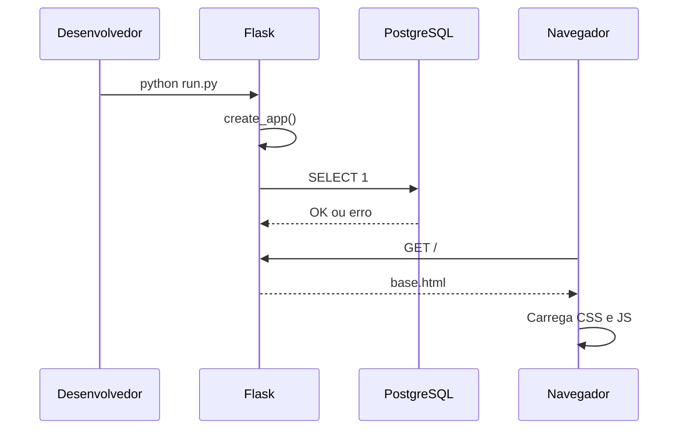
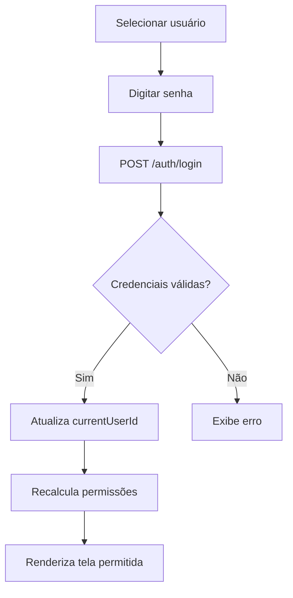
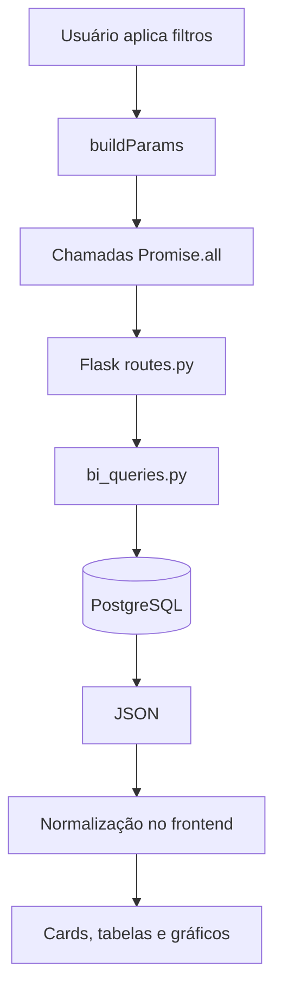
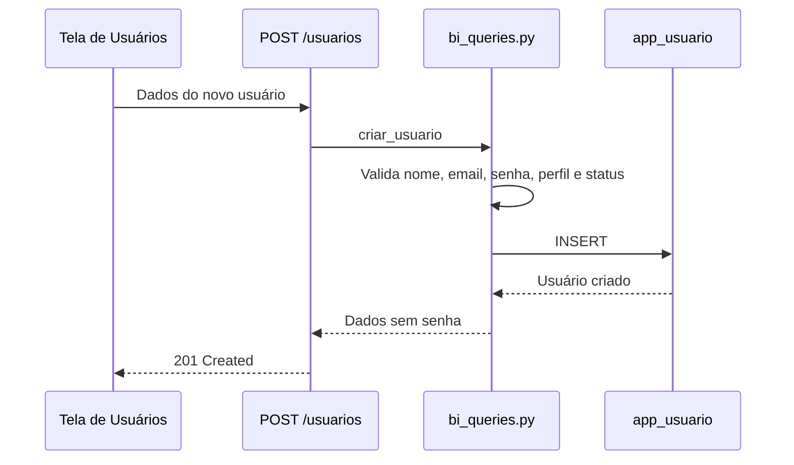

# Fluxo do Sistema

## Fluxo de Inicialização



## Fluxo de Carregamento de Dados

1. `init()` executa no frontend.
2. `loadUsers()` consulta `/usuarios`.
3. `loadSelects()` consulta `/filiais` e `/categorias`.
4. `loadProducts()` consulta `/produtos`.
5. `refreshData()` consulta endpoints de KPIs.
6. `render()` monta a tela atual.

## Fluxo de Login



## Fluxo de Dashboard



## Fluxo de Nova Venda

1. Usuário acessa tela "Nova Venda".
2. Seleciona cliente, produto, filial e data.
3. Informa quantidade e desconto.
4. Frontend envia `POST /vendas`.
5. Backend valida campos obrigatórios.
6. Service busca produto, filial e cliente.
7. Calcula valores monetários.
8. Insere venda em `fato_vendas`.
9. Insere item em `fato_itens_venda`.
10. Atualiza `vm_kpis_comercial_mensal`.
11. Frontend recarrega dashboards.

## Fluxo de Usuários

### Criação



### Alteração de Status

Regras:

- status permitido: `Ativo`, `Inativo`;
- não inativar último administrador ativo.

### Remoção

Regra:

- não remover último administrador ativo.

## Fluxo de Fallback

Quando uma chamada opcional falha:

1. `fetchOptional()` captura erro.
2. `state.usingMock = true`.
3. A interface usa dados demonstrativos.
4. O alerta de banco indisponível é exibido.

## Fluxo de Manutenção de View

Após cadastro de venda:

```sql
REFRESH MATERIALIZED VIEW comercial.vm_kpis_comercial_mensal;
```

Isso garante que os dashboards reflitam a venda recém-inserida.
