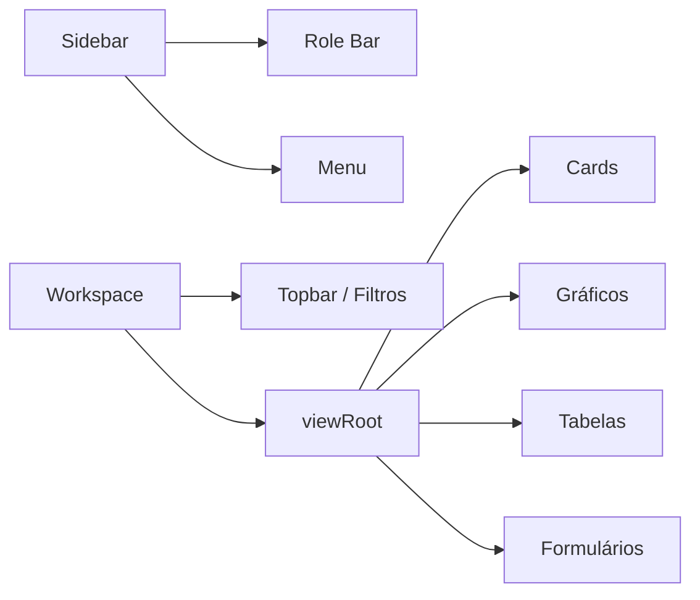

# Frontend

## Visão Geral

O frontend é uma single page interface construída com HTML, CSS e JavaScript puro. O Flask entrega `base.html`, e `script.js` controla navegação, autenticação visual, chamadas API, renderização de telas, tabelas e gráficos.

## Arquivos

| Arquivo | Função |
|---|---|
| `app/templates/base.html` | Estrutura principal da página. |
| `app/static/css/style.css` | Estilos, layout, responsividade e componentes. |
| `app/static/js/script.js` | Estado, permissões, API, renderização e eventos. |

## Layout

A interface possui:

- alerta superior de banco indisponível;
- sidebar fixa;
- marca "Aurora BI";
- Role Bar;
- menu de navegação;
- área principal de trabalho;
- filtros globais;
- raiz dinâmica `#viewRoot`.



## Componentes

| Componente | Implementação |
|---|---|
| Sidebar | HTML fixo em `base.html`, estilizado por `.sidebar`. |
| Role Bar | Select de usuário, campo senha e botão de autenticação. |
| Navbar | Gerada por `renderNav()`. |
| Filtros | Inputs de data e selects de filial, categoria e produto. |
| Cards KPI | Criados por `card()` e `renderKpis()`. |
| Gráficos | Criados por `renderCharts()` com Chart.js. |
| Tabelas | Criadas por helper `table()`. |
| Formulários | Usuário e nova venda. |

## Estado da Interface

O objeto `state` centraliza:

| Campo | Descrição |
|---|---|
| `currentUserId` | Usuário autenticado atualmente. |
| `currentScreenId` | Tela ativa. |
| `charts` | Instâncias Chart.js para destruição antes de redesenhar. |
| `data` | Dados normalizados dos dashboards. |
| `users` | Usuários carregados de `/usuarios`. |
| `apiFiliais` | Filiais vindas do banco. |
| `apiProducts` | Produtos detalhados. |
| `apiClients` | Clientes. |
| `usingMock` | Indica fallback de dados demonstrativos. |
| `usingMockUsers` | Indica fallback de usuários locais. |

## Permissões Visuais

As permissões são definidas em `roleProfiles`:

```javascript
const roleProfiles = {
    administrador: { permissions: ["dashboard:geral", "usuarios:gerenciar"] },
    gerente: { permissions: ["dashboard:geral", "usuarios:criar"] },
    vendedor: { permissions: ["dashboard:vendas", "vendas:criar"] },
    analista: { permissions: ["dashboard:geral", "relatorios:ver"] }
};
```

Cada tela em `screens` exige uma permissão.

## Autenticação na Interface

Fluxo:

1. Carrega usuários de `/usuarios`.
2. Usuário escolhe perfil e digita senha.
3. `authenticateSelectedUser()` envia senha para `/auth/login`.
4. Se validado, `currentUserId` é atualizado.
5. A UI recalcula permissões e tela permitida.

## Gráficos

Biblioteca: Chart.js via CDN.

Tipos utilizados:

- `line`: evolução temporal.
- `bar`: rankings e comparações.
- `doughnut`: participação por categoria.

Antes de renderizar uma nova tela, `clearCharts()` destrói instâncias antigas para evitar sobreposição.

## Tabelas

As tabelas são criadas com:

```javascript
function table(headers, rows) {
    return `
        <div class="table-wrap">
            <table>...</table>
        </div>
    `;
}
```

## Formulários

### Cadastro de Usuário

Campos:

- nome;
- email;
- senha;
- perfil;
- status.

Backend: `POST /usuarios`.

### Nova Venda

Campos:

- cliente;
- produto;
- quantidade;
- desconto;
- filial;
- data.

Backend: `POST /vendas`.

## Responsividade

O CSS define:

- grid principal com sidebar e workspace;
- cards em grid responsivo;
- filtros em grid;
- tabelas em wrapper para overflow;
- raio de borda consistente em 8px.

## Fallback

Se endpoints falham, `fetchOptional()` ativa `state.usingMock` e usa dados demonstrativos. Isso mantém a interface navegável quando o banco não está disponível.

## Pontos de Atenção

- O controle de permissões é visual, não substitui segurança backend.
- As senhas de fallback ficam no JS para ambiente didático.
- Chart.js depende de internet por CDN.
- O frontend não usa framework; manutenções devem preservar funções pequenas e renderização por tela.
