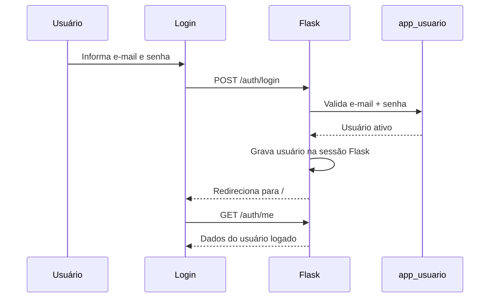

# Permissões e Autenticação

## Visão Geral

O sistema possui quatro perfis funcionais:

- Admin Comercial (`admin_comercial`)
- Gerente Comercial (`gerente_comercial`)
- Operador Comercial (`operador_comercial`)
- Leitura Comercial (`leitura_comercial`)

As permissões são declaradas no frontend em `roleProfiles`, dentro de `app/static/js/script.js`, e as ações sensíveis também são validadas no backend em `ROLE_PERMISSIONS`, dentro de `app/routes.py`. Os usuários da aplicação são persistidos no banco na tabela `comercial.app_usuario`.

## Usuários Padrão

| Perfil | Email | Senha | Status |
|---|---|---|---|
| Admin Comercial | `admin@aurora.local` | `admin123` | Ativo |
| Gerente Comercial | `gerente@aurora.local` | `gerente123` | Ativo |
| Operador Comercial | `operador@aurora.local` | `operador123` | Ativo |
| Leitura Comercial | `leitura@aurora.local` | `leitura123` | Ativo |

## Perfis

### Admin Comercial

Permissões completas:

- visualizar todos os dashboards;
- visualizar produtos, clientes, filiais, vendas e relatórios;
- cadastrar vendas;
- gerenciar usuários;
- criar usuários;
- editar status de usuários;
- remover usuários;
- visualizar matriz de permissões.

### Gerente Comercial

Permissões:

- visualizar dashboards;
- visualizar produtos, clientes, filiais e vendas;
- visualizar relatórios.

Restrição:

- não gerencia usuários e não cadastra vendas na matriz atual.

### Operador Comercial

Permissões:

- visualizar dashboard de vendas;
- visualizar produtos;
- visualizar clientes;
- cadastrar novas vendas;
- consultar somente sua visão operacional.

Restrição atual:

- o frontend reduz visualmente a visão de vendas para um recorte, mas não há filtro backend por operador autenticado.

### Leitura Comercial

Permissões:

- visualizar dashboards;
- visualizar produtos, clientes, filiais e vendas;
- visualizar relatórios.

Restrições:

- não cria vendas;
- não gerencia usuários;
- não altera cadastros.

## Matriz de Permissões

| Tela/Função | Admin Comercial | Gerente Comercial | Operador Comercial | Leitura Comercial |
|---|---:|---:|---:|---:|
| Dashboard geral | Sim | Sim | Não | Sim |
| Dashboard de vendas | Sim | Sim | Sim | Sim |
| Dashboard por filial | Sim | Sim | Não | Sim |
| Dashboard por categoria | Sim | Sim | Não | Sim |
| Nova venda | Sim | Não | Sim | Não |
| Produtos | Sim | Sim | Sim | Sim |
| Clientes | Sim | Sim | Sim | Sim |
| Gerenciar usuários | Sim | Não | Não | Não |
| Criar usuário | Sim | Não | Não | Não |
| Editar usuário | Sim | Não | Não | Não |
| Remover usuário | Sim | Não | Não | Não |
| Permissões | Sim | Não | Não | Não |
| Relatórios | Sim | Sim | Não | Sim |

## Fluxo de Login



## Controle de Telas

Cada item de navegação possui uma permissão:

```javascript
{ id: "dashboard-geral", permission: "dashboard:geral" }
```

Antes de renderizar uma tela, o frontend executa:

```javascript
hasPermission(state.currentScreenId)
```

Se não houver acesso, a tela `renderDenied()` é exibida.

## Controle de Botões

Botões de ação são renderizados condicionalmente:

```javascript
const canCreate = can("usuarios:criar");
const canEdit = can("usuarios:editar");
const canRemove = can("usuarios:remover");
```

## Validações Backend

O backend valida:

- sessão ativa para endpoints da API;
- permissão por perfil nas ações de usuários e cadastro de venda;
- nome mínimo de usuário;
- email em formato válido;
- email único;
- senha mínima;
- perfil permitido;
- status permitido;
- bloqueio de inativação do último `admin_comercial` ativo;
- bloqueio de remoção do último `admin_comercial` ativo.

## Proteção de Rotas

Estado atual:

- `/` exige sessão e redireciona usuários não autenticados para `/login`;
- endpoints de API usam `api_login_required`;
- ações sensíveis retornam `403` quando o perfil não possui permissão;
- a navegação continua filtrada visualmente no frontend.

Melhoria recomendada:

- evoluir para `Flask-Login` ou sessão server-side;
- consolidar um decorator `@require_permission`;
- ampliar permissões backend para consultas analíticas se necessário;
- armazenar senha com hash.

## Middleware

O projeto usa decorators locais em `routes.py` para sessão e autorização. O handler global existente trata `OperationalError` de banco.

## DCL do PostgreSQL

O script de banco cria roles PostgreSQL:

- `admin_comercial`;
- `gerente_comercial`;
- `operador_comercial`;
- `leitura_comercial`.

Essas roles controlam permissões no banco. A tabela `app_usuario` controla os perfis da aplicação e usa os mesmos identificadores.
